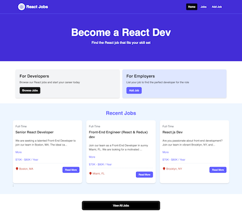

# README

## Description

These are the local files I created while following the Traversy Media tutorial [React Crash Course](https://www.youtube.com/watch?v=LDB4uaJ87e0).

- [Project repository](https://github.com/bradtraversy/react-crash-2024)

I didn't clone or fork the project repo because I wanted to create everything from scratch. I also wanted to gain experience resolving any implementation details that had changed since the tutorial was first created. You can find my notes below.

This tutorial was a good introduction to React and I found many similarities to what I've already done with Vue.js.

## Technologies used

- JavaScript
- Vite
- Tailwind CSS 4
- React 4
- React Router DOM
- JSON Server
- React-Icons
- React-Spinners
- React-Toastify

## Install and run from repo

```sh
npm install
npm run dev
```

## Notes about tutorial

### Initial setup

(copy sections into Notes- React.md)

Create project:

```sh
cd ~/Dev
npm create vite@latest traversy_react_crash_course
```

- Project name: vite-project (default)
- Framework: React
- Variant: JavaScript (should I use JavaScript with React compiler?)
- Use rolldown-vite: No
- Install with npm and start now? No

Run project:

```sh
npm install # install dependencies
npm run dev # run project
```

Rename `README.md` to `README_default.md`

Copy custom `README.md` and Brad's `_theme_files` directory into project directory

VSCode: Install "ES7+ React/Redux/React-Native snippets" extension

- `rafce`: Starter JSX function

### Tailwind v4 setup

`npm install tailwindcss @tailwindcss/vite`

Add `@tailwindcss/vite` plugin to Vite config:

```js
import tailwindcss from '@tailwindcss/vite'
...
export default defineConfig({
  plugins: [
    tailwindcss()
  ],
});
```

There is no `tailwind.config.js` file anymore and there's no need to specify directories for watching Tailwind files. The `content` property has been replaced by an automatic system that scans project files for Tailwind classes.

Add `@import "tailwindcss"` to the top of the app's CSS file

VSCode:

- Install the [Tailwind CSS Intellisense](https://marketplace.visualstudio.com/items?itemName=bradlc.vscode-tailwindcss) extension by Tailwind Labs
- When viewing a CSS file that uses Tailwind at-rules, change the language mode from "CSS" to "Tailwind CSS"

Edit the settings for the current workspace to make VSCode automatically use the "Tailwind CSS" language mode for CSS files in this project:

```json
{
  "settings": {
    "files.associations": {
      "*.css": "tailwindcss"
    },
  }
}
```

## Cliploader

The import for the ClipLoader spinner is slightly different than his example:

```js
import { ClipLoader } from 'react-spinners';
```

## Error: Fast Refresh/jobLoader export

I got the following error message...

"Could not Fast Refresh ('jobLoader' export is incompatible). Learn more at [consistent-components-exports](https://github.com/vitejs/vite-plugin-react/tree/main/packages/plugin-react#consistent-components-exports)"

...and I found the solution online: "Vite's Fast Refresh mechanism requires that files containing React components only export React components or other values used solely within that file. Non-component exports like your jobLoader function cause Fast Refresh to disable Hot Module Replacement (HMR) for that file to prevent potential side-effects."

To address this, I moved the `jobLoader` code into its own file at `src/jobLoader.js`:

```js
const jobLoader = async ({ params }) => {
  const res = await fetch(`/api/jobs/${params.id}`);
  const data = await res.json();
  return data;
};

export { jobLoader };
```

And I restored the original simpler version of `components/JobPage.jsx` without `jobLoader`:

```js
import { useLoaderData } from 'react-router-dom';

const JobPage = () => {
  const job = useLoaderData();

  return <h1>{job.title}</h1>;
};

export default JobPage;
```

The router still needed access to `jobLoader` so I imported it in `App.jsx`:

```js
import { jobLoader } from './jobloader';
```

## Error: HydrateFallback

Another error message in the browser:

"installHook.js: No `HydrateFallback` element provided to render during initial hydration"

This was caused by not specifying a fallback element while we're fetching data asynchronously on the client. The framework needs to show something during hydration while the data is being fetched.

One solution was to create a dummy loading element and specify it in the route:

```js
const MyLoadingFallback = () => <p>Loading...</p>;

const router = createBrowserRouter(
  createRoutesFromElements(
    <Route path="/" element={<MainLayout />}>
      <Route index element={<HomePage />} />
      <Route path="/jobs" element={<JobsPage />} />
      <Route
        path="/jobs/:id"
        element={<JobPage />}
        loader={jobLoader}
        HydrateFallback={MyLoadingFallback}
      />
      <Route path="*" element={<NotFoundPage />} />
    </Route>
  )
);
```

## JobPage.jsx

As a workaround for Brad's custom CSS Grid style I replaced `md:grid-cols-70/30` with `md:grid-cols-[70%_30%]`

## react-toastify

As of Version 11 react-toastify no longer requires a separate CSS import. The stylesheet is now injected automatically.

## Screenshot


